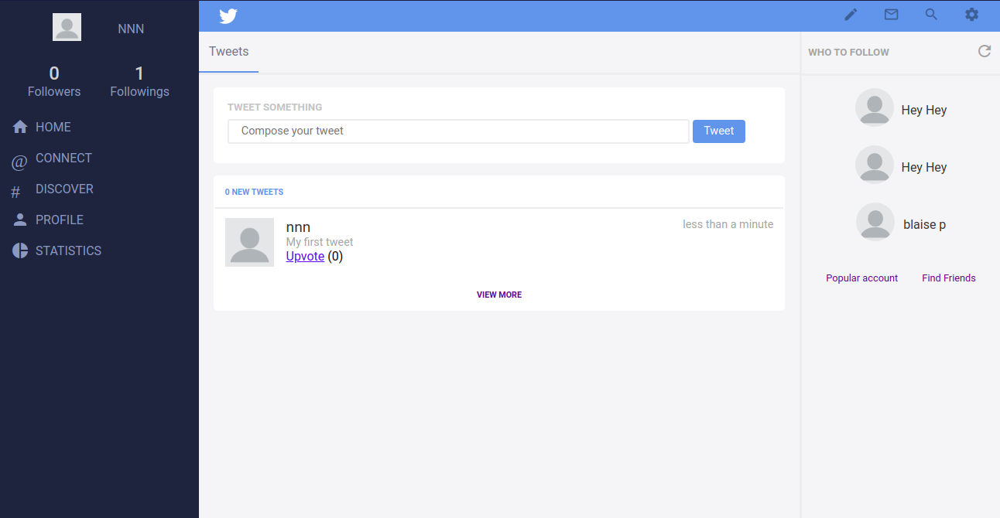
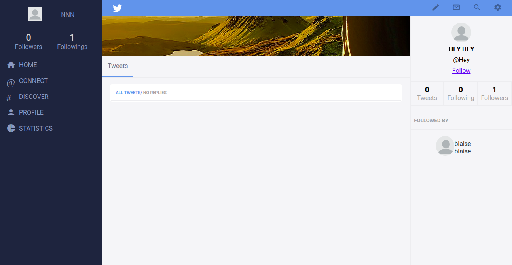

# Twitter-Poets

This project is a Twitter-like social media app where users share mostly poetic content. A user can create an account, Compose tweets, follow other users, and view their tweets. A user can also upvote the tweet they like.




## Built With

- Ruby v2.7.0
- Ruby on Rails v5.2.4

## Live Demo

[Live demo link](https://protected-fjord-05413.herokuapp.com/)

## Project walkthrough video

[Walkthrough video](https://www.loom.com/share/b70accda31494b85b3609b2a2174db01)

## Getting Started

To get a local copy up and running follow these simple example steps.

### Prerequisites

- Ruby: 2.6.3
- Rails: 5.2.3
- Postgres: >=9.5

### Setup

Clone this repository by running:

```
git clone https://github.com/Blaise-Shyaka/poets-twitter
```

Install gems with:

```
bundle install
```

Install and check dependencies with:

```
yarn install --check-files
```

Setup database with:

```
   rails db:create
   rails db:migrate
```

### Usage

Start server with:

```
    rails server
```

Open `http://localhost:3000/` in your browser.

### Run tests

```
    rpsec --format documentation
```

## Authors

👤 **Blaise Pascal SHYAKA**

- GitHub: [@Blaise-Shyaka](https://github.com/Blaise-Shyaka/)
- Twitter: [@blaise_shyaka95](https://twitter.com/blaise_shyaka95)
- LinkedIn: [Blaise Pascal SHYAKA](https://linkedin.com/in/blaise-pascal-shyaka)

## 🤝 Contributing

Contributions, issues and feature requests are welcome!

Feel free to check the [issues page](https://github.com/Blaise-Shyaka/Twitter-Poets/issues).

## Show your support

Give a ⭐️ if you like this project!

## Acknowledgments

- [@Microverse](https://www.microverse.org/) for the project idea and code review
- [@Gregoire Vella](https://www.behance.net/gregoirevella) for the design inspiration
